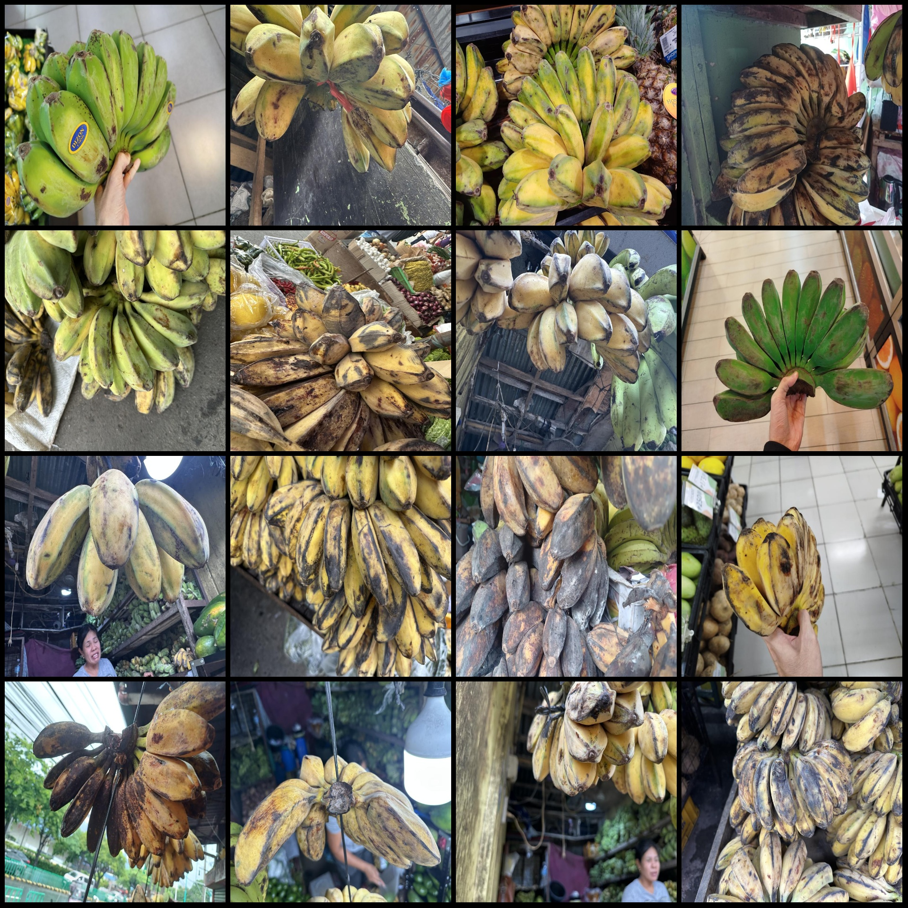
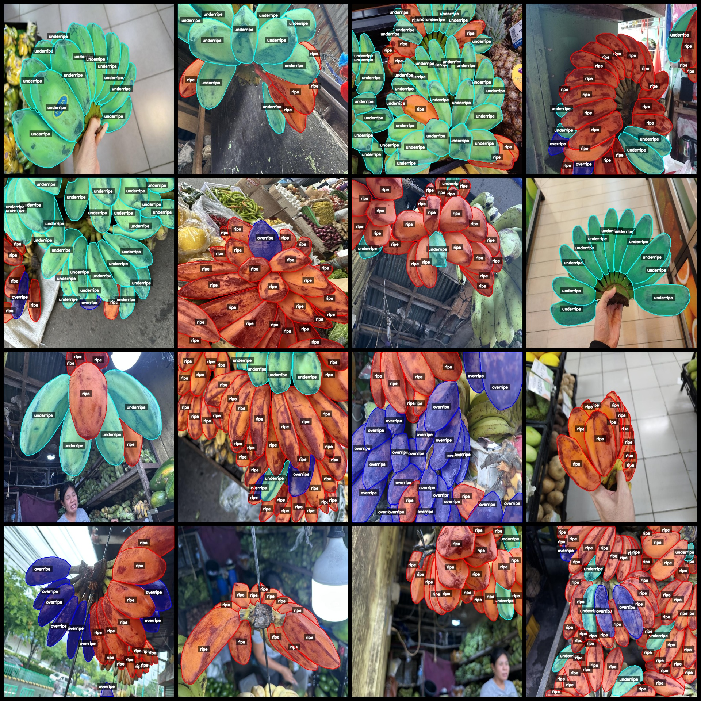
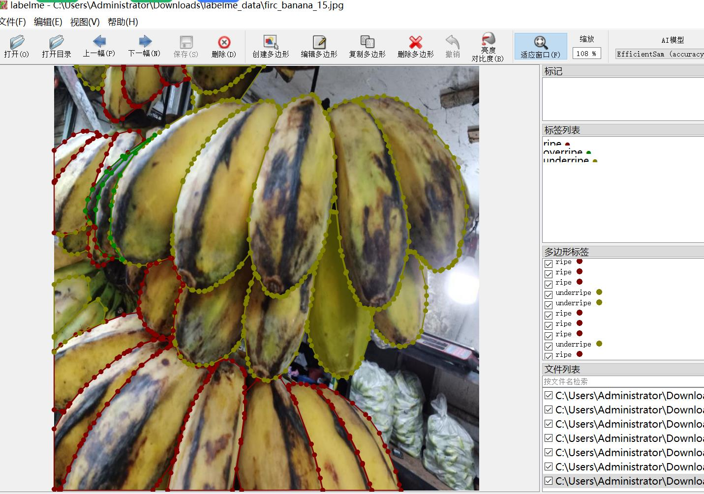

# Kadaiba Banana Maturity Identification and Segmentation Dataset: 702 Images in labelme Format (3 Categories)

Dataset format: labelme format (without mask files, only containing jpg images and corresponding json files).
Number of images (number of jpeg files): 702
Number of annotations (number of json files): 702
Number of annotation categories: 3
Annotation category names: ["ripe", "overripe", "underripe"]
Each category's number of bounding boxes:
- ripe (ripe) count = 6591
- overripe (overripe) count = 2521
- underripe (underripe) count = 8329
Total bounding box count: 17441

Annotation tool used: labelme v5.5.0
Image resolution: 800x800
Annotation rules: Polygon drawing for categories
Important note: The dataset can be edited using the labelme editor; the json dataset needs to be converted into either mask or yolo format or coco format for semantic segmentation or instance 
segmentation.
Special declaration: This dataset does not guarantee the accuracy of the trained models or weight files.

Preview of labeled examples:

Original images (randomly selected 16 images):
Annotation drawing results:
Labelme editing image example:

## Images

Here is a pay link on Stripe ( https://buy.stripe.com/3cs8yP7sY87d0vu9AB ). Please contact me lonlonago@foxmail.com after funding $89, and I will send you a complete data files , thank you!

